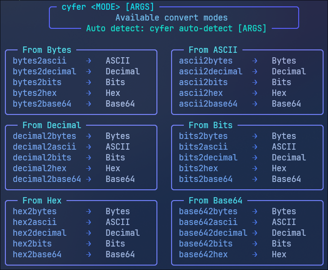
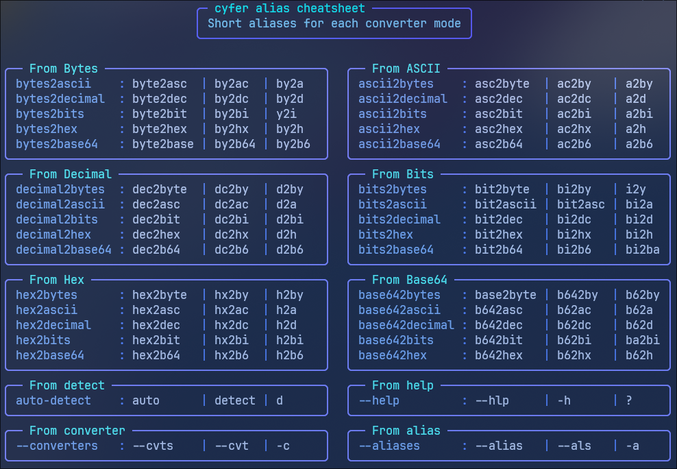

# cyfer

Fast CLI for byte-level encoding conversions written in C; convert between raw Bytes, ASCII, Decimal, Bits, Hex, and Base64.

## Architecture

Check out [architecture](architecture.md) for design decisions and how cyfer works.

## Install

### Prerequisites

- GCC or Clang
- Make
- (Optional) Valgrind for `make test`

### Build & Install

```bash
git clone https://github.com/purrtc0l/cyfer
cd cyfer
make                   # build the binary
make install           # installs to ~/.local/bin/
```

**Note:** Make sure `~/.local/bin/` is in your `$PATH`. Add this to your `~/.zshrc` if needed:

```bash
export PATH="$HOME/.local/bin:$PATH"
```

### Test

**Prerequisites**: Any binary file (or compile the example below)

Quick example:

```bash
echo -e '#include <stdio.h>\n\nint main(void) {\n    printf("Hello for cyfer test!\\n");\n    return 0;\n}' > hello_cyfer.c && gcc hello_cyfer.c -o hello_cyfer
# Update ELF path in tests/cyfer_test
make test
```

### Uninstall

```bash
make uninstall
make clean
```

## Usage

### Interactive Mode

Interactive prompt with examples; add `--quiet` flag to suppress banner. Output aligns automatically. Ideal for single line input and preview.

```bash
$ cyfer <MODE> [OPTION]

$ cyfer ascii2decimal
╰─ ASCII → Decimal
  Paste ASCII (e.g., Hello)

❯ Hello
 72 101 108 108 111

$ cyfer bits2hex --quiet

❯ 01001000 01100101 01101100 01101100 01101111
48 65 6C 6C 6F
```

### CLI Mode

Directly pass your value after the MODE.

```bash
$ cyfer <MODE> [OPTION] <ARGS>

$ cyfer ascii2decimal "Hello"
 72 101 108 108 111

$ cyfer base642bits "SGVsbG8="
01001000 01100101 01101100 01101100 01101111

$ cyfer d "68 65 6C 6C 6F"
Hex (50.00%) · might be ASCII
→ ASCII: hello
→ Decimal: 104 101 108 108 111 
→ Bits: 01101000 01100101 01101100 01101100 01101111 
→ Base64: aGVsbG8=
```

#### Custom token delimiters

Default delimiters: " ,;" (space, `,`, `;`). To custom token delimiters, use `--delimiters`:

```bash
$ cyfer bits2ascii --delimiters "♥" "01001000♥♥♥01100101♥♥♥01101100♥♥01101100♥01101111"
Hello
$ cyfer d2a "72|101|108|108|111" -D "|"
Hello
```

Note this flag is only for Decimal/Bits/Hex in *non-interactive* modes.

### Pipe Mode

Automatically detects non-TTY input and processes stdin. Ideal for many lines / long data stream.

**Examples:**

Read from a file:

```bash
$ cyfer <MODE> < <FILE>

$ cyfer bytes2ascii < hello_world

$ cat <FILE> | cyfer <MODE>

$ cat hello_world | ./cyfer bytes2bits
```

Pipe file content:

```bash
$ cat <FILE> | cyfer <MODE>

$ cat hello | cyfer bytes2decimal | cyfer decimal2ascii

$ cat << 'EOF' | cyfer bits2ascii
01001000 01100101 01101100 01101100 01101111
EOF

$ cat a_binary_file | cyfer auto-detect | less
```

Pipe from another command:

```bash
$ echo "Hello" | cyfer <MODE>
$ curl -s https://example.com/data | cyfer <MODE>
```

Binary output support:

```bash
$ cyfer <MODE> <ARG> > <FILE>

$ cyfer ascii2bytes "hello" > hello.bin

$ echo <ARG> | cyfer <MODE> > <FILE>

$ echo "48 65 6C 6C 6F" | cyfer hex2bytes > output.bin
```

## Error Handling

<details>
<summary>Click to expand</summary>

```text
=== Error Handling ===
Test: unknown commands
-> cyfer fuck
Error: unknown command: fuck
Try cyfer --help.
-> cyfer dumb ass
Error: unknown command: dumb
Try cyfer --help.
-> cyfer gibberish923743@_-+=[]''
Error: unknown command: gibberish923743@_-+=[]
Try cyfer --help.

Test: defining delimiters without value
-> cyfer h2a 65 66 67 -d
Error: -d requires an argument

Test: not support interactive mode
-> cyfer bytes2hex
Error: 'bytes2hex' does not support interactive mode.
Usage: 
  cyfer bytes2hex < <FILE>
  cat <FILE> | cyfer bytes2hex
-> cyfer ascii2bytes
Error: 'ascii2bytes' does not support interactive mode.
Usage: 
  cyfer ascii2bytes <ARG> > <FILE>
  echo <ARG> | cyfer ascii2bytes > <FILE>
```

</details>

Run `make test` for more details.

## Cheatsheet

```bash
$ cyfer --help
```

```txt
cyfer - fast, pipe-friendly converter CLI

Usage: cyfer <MODE> [OPTION] [ARGS]
  Interactive: cyfer <MODE> [OPTION]
  CLI:         cyfer <MODE> [OPTION] <ARGS>
  Pipe:        cat <FILE> | cyfer <MODE> [OPTION]

Options:
  --quiet, -q            suppress banner in interactive mode
  --delimiters, -D <str> custom token delimiters (default: " ,;")
                         for Decimal/Bits/Hex in non-interactive modes
  --help, -h             display this help text and exit
  --converters, -c       list all converters (table format)
  --aliases, -a          list short aliases
  --version, -v          display version information and exit

Convert Modes:

  Bytes modes (pipe-only, no interactive):
    bytes2ascii, by2a      Bytes → ASCII
    bytes2decimal, by2d    Bytes → Decimal
    bytes2bits, by2bi      Bytes → Bits
    bytes2hex, by2h        Bytes → Hex
    bytes2base64, by2b6    Bytes → Base64

  From ASCII:
    ascii2bytes, a2by      ASCII → Bytes (output binary)
    ascii2decimal, a2d     ASCII → Decimal
    ascii2bits, a2bi       ASCII → Bits
    ascii2hex, a2h         ASCII → Hex
    ascii2base64, a2b6     ASCII → Base64

  From Decimal (tokenizable input):
    decimal2bytes, d2by    Decimal → Bytes (output binary)
    decimal2ascii, d2a     Decimal → ASCII
    decimal2bits, d2bi     Decimal → Bits
    decimal2hex, d2h       Decimal → Hex
    decimal2base64, d2b6   Decimal → Base64

  From Hex (tokenizable input):
    hex2bytes, h2by        Hex → Bytes (output binary)
    hex2ascii, h2a         Hex → ASCII
    hex2decimal, h2d       Hex → Decimal
    hex2bits, h2bi         Hex → Bits
    hex2base64, h2b6       Hex → Base64

  From Bits (tokenizable input):
    bits2bytes, bi2by      Bits → Bytes (output binary)
    bits2ascii, bi2a       Bits → ASCII
    bits2decimal, bi2d     Bits → Decimal
    bits2hex, bi2h         Bits → Hex
    bits2base64, bi2ba     Bits → Base64

  From Base64:
    base642bytes, b62by    Base64 → Bytes (output binary)
    base642ascii, b62a     Base64 → ASCII
    base642decimal, b62d   Base64 → Decimal
    base642bits, ba2bi     Base64 → Bits
    base642hex, b62h       Base64 → Hex

  Special:
    auto-detect, d         detect format and show all representations
                           displays confidence score and alternatives

Note: Use --delimiters to customize token separators for Decimal/Hex/Bits
```

```bash
$ cyfer --converters
```

<div align="center">
  
</div>

```bash
$ cyfer --aliases
```

<div align="center">
  
</div>
